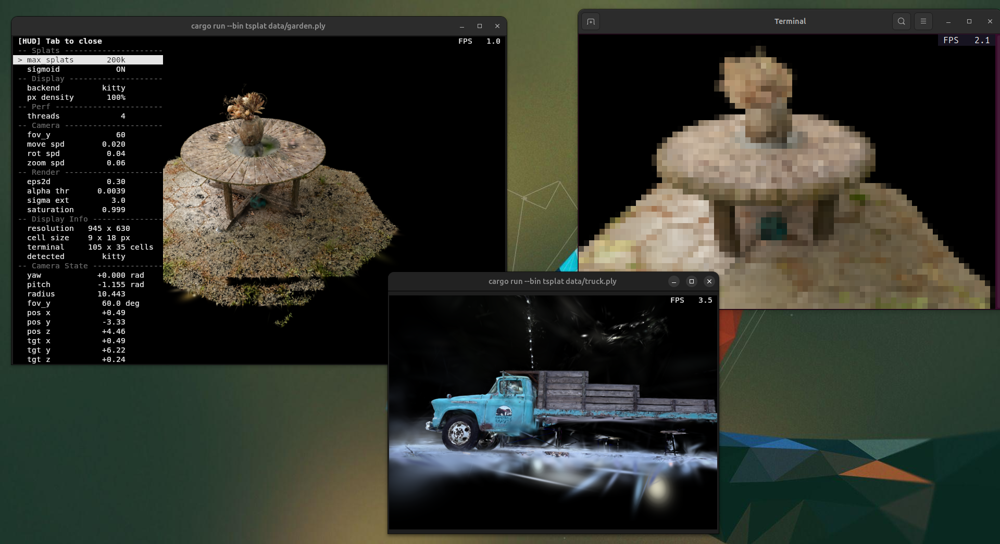
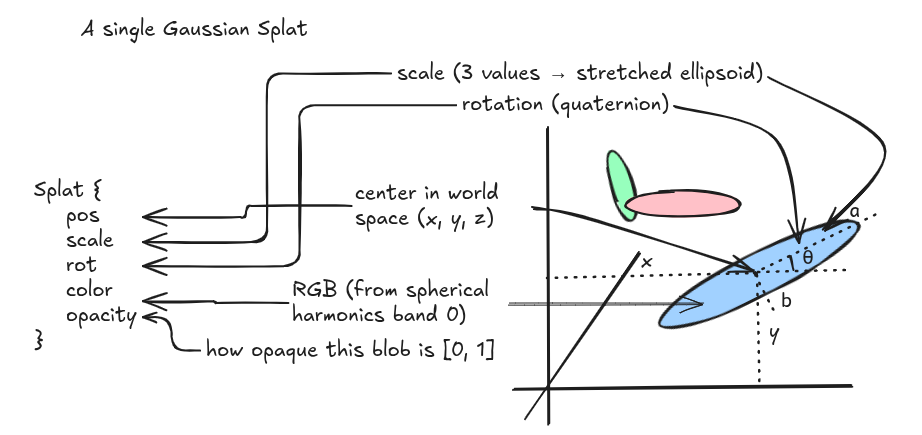
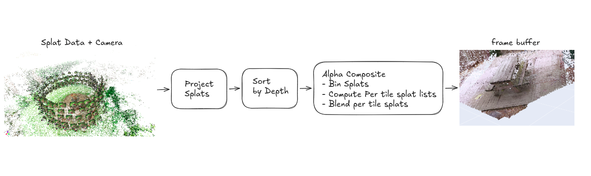
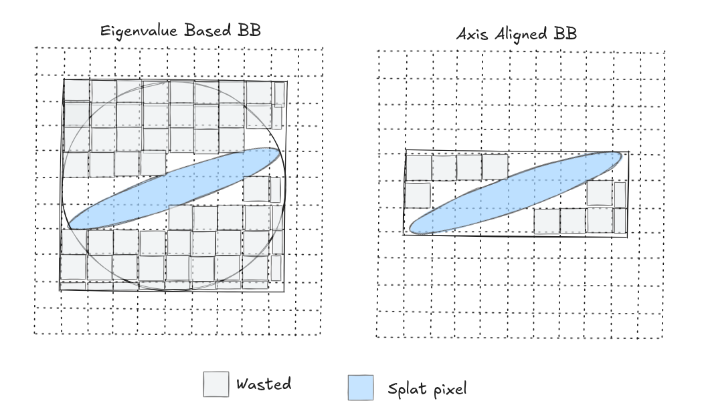
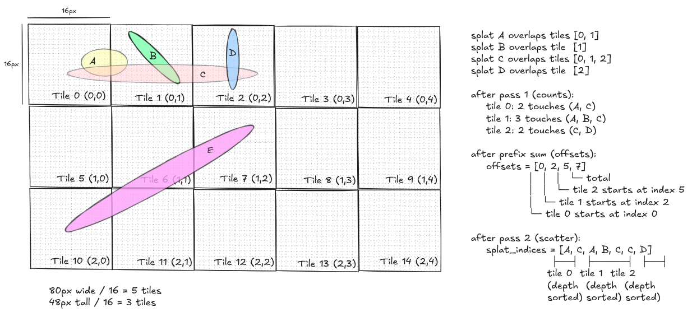

# tsplat

Run Gaussian Splatting in your terminal, works over SSH, and supports xterm, kitty, GNOME, Konsole, it's fast, written in rust and is CPU only



## Installation

```bash
cargo install --git 
```

## Tutorial on Gaussian Splatting

I recently discovered some of my notes related to it and decided to digitize it this weekend, along the way I reimplemented the forward rasterization pass in rust and decided it would be fun to write a tutorial explaining gaussian splatting to everyone, so here it is

- [What is a splat?](#what-is-a-gaussian-splat)
- [The forward pass pipeline](#the-forward-pass-pipeline)
- [step 1: Projecting Splats](#step-1-projecting-splats)
- [step 2: transform into view space](#step-2-transform-into-view-space)
- [step 3: project to 2D (the Jacobian)](#step-3-project-to-2d-the-jacobian)
- [step 4: compute bounding boxes](#step-4-compute-bounding-boxes)
- [step 5: depth sort](#step-5-depth-sort)
- [step 6: tile binning](#step-6-tile-binning)
- [step 7: alpha compositing](#step-7-alpha-compositing)
- [the optimizations](#the-optimizations)

## what is a gaussian splat?

a 3D Gaussian splat is an oriented ellipsoid in space that carries some color and opacity. you can think of it as a fuzzy colored blob. a scene is made of hundreds of thousands of these blobs, and when you look at them from a particular viewpoint, they overlap and blend to form the final image

We represent each gaussian with these attributes:

```rust
pub struct Splat {
    pub pos: Vec3,      // center position in world space
    pub scale: Vec3,    // size along each local axis
    pub rot: Quat,      // orientation as a unit quaternion
    pub color: Vec3,    // RGB color (already decoded from spherical harmonics)
    pub opacity: f32,   // how opaque this blob is, in [0, 1]
}
```

scales are stored in log space, opacities as logits, colors as spherical harmonics coefficients and quaternions are normzlied to unit length to ensure the values lie within their respective range



spherical harmonic (SH) coefficients are just a frequency-domain representation of a color function defined over the unit sphere, now why spherical harmonics? because in the real world, the color of a surface depends on the viewing direction. SH coefficients encode this view-dependent appearance compactly.

SH functions are organized in bands (like octaves in music), as you go higher up in the bands you have more coefficients and thus they capture more finer details, the INRIA 3DGS format stores up to band 3 (48 coefficients per splat for RGB)

To decode bash 0, the band-0 SH basis function is $Y_0^0 = \frac{1}{2\sqrt{\pi}} \approx 0.282$. the conversion from SH coefficient to RGB is:

$$\text{color} = \text{clamp}\left(0.5 + C_0 \cdot f_{dc},\ 0,\ 1\right)$$

where $C_0 = Y_0^0$ and $f_{dc}$ is the 3-component DC coefficient from the file.

```rust
pub const SH_C0: f32 = 0.28209479177387814;

pub fn sh_band0_to_rgb(f_dc: Vec3) -> Vec3 {
    (Vec3::splat(0.5) + SH_C0 * f_dc).clamp(Vec3::ZERO, Vec3::ONE)
}
```

## the forward pass pipeline

the forward pass turns a list of 3D Gaussians + a camera into a 2D image. here is an overview of the rendering pipeline:



## Step 1: Projecting Splats

### 1.1: building the 3D covariance matrix

for each splat given the raw `(scale, rotation)` pairs we need to construct a 3D covariance matrix $\Sigma$ that describes the shape and orientation of the Gaussian in world space. the formula is:

$$\Sigma = R \cdot S \cdot S^T \cdot R^T$$

where R is the 3×3 rotation matrix from the quaternion, and S is a diagonal matrix of scales. if we let M = R·S, this simplifies to:

$$\Sigma = M \cdot M^T$$

```rust
let r_mat = Mat3::from_quat(s.rot);
let s_mat = Mat3::from_diagonal(s.scale);
let m = r_mat * s_mat;
let cov3d = m * m.transpose();
```

---

**Note: why dowe decompose the covariance this way?**

Covariance matrices have physical meaning only when they are **positive semi-definite**. gradient descent cannot easily be constrained to produce valid matrices, by expressing the covariance as $M \cdot M^T$, it is guaranteed to be positive semi-definite, a matrix of the form $A^T A$ always is. this is a reparametrization trick: we optimize `scale` and `rotation` separately, which are unconstrained, and the covariance we derive from them is always valid

---

what does this matrix actually look like? for a splat with `scale = (0.1, 0.05, 0.02)` and identity rotation:

$$
\Sigma =
\begin{pmatrix}
0.01 & 0 & 0 \\
0 & 0.0025 & 0 \\
0 & 0 & 0.0004
\end{pmatrix}
\quad
\begin{aligned}
&= \text{diag}(0.1^2,\; 0.05^2,\; 0.02^2)
\end{aligned}
$$

with identity rotation, it is just the squared scales on the diagonal, an axis-aligned ellipsoid

### 1.2: transforming into view space

the 3D covariance we just computed lives in world space. to project it onto the camera's image plane, we first need to rotate it into view space, the coordinate system where the camera is at the origin, looking down −z

for the splat center, this is just a matrix-vector multiply with the 4×4 view matrix:

```rust
let p_view4 = view * Vec4::new(s.pos.x, s.pos.y, s.pos.z, 1.0);
let p_view = Vec3::new(p_view4.x, p_view4.y, p_view4.z);
if p_view.z > -znear || p_view.z < -zfar {
    return None;
}
let zc = -p_view.z;
```

note `zc = -p_view.z`. our view space is right-handed with the camera looking down **−z**, so points in front of the camera have negative z. we use `zc` (positive in front) as the depth for sorting and projection.

for the covariance, we rotate it by the 3×3 part of the view matrix W:

$$\Sigma_{view} = W \cdot \Sigma \cdot W^T$$

```rust
let w_mat = Mat3::from_mat4(view);
let w_mat_t = w_mat.transpose();

let cov3d_view = w_mat * cov3d * w_mat_t;
```

this is just the standard basis-change formula for a covariance matrix. the shape of the ellipsoid does not change due to this infact we are only re-expressing it in the camera's coordinate system.

### 1.3: projecting to 2D

now we have a 3D Gaussian in view space and we need to project it onto the 2D image plane. the projection is perspective, which means a 3D Gaussian does not project to an exact 2D Gaussian because perspective is a nonlinear transform. but we can locally linearize it using the Jacobian of the projection function, and the result is close enough.

the projection function maps a 3D point (x, y, z) in view space to pixel coordinates (u, v):

$$u = f_x \cdot \frac{x}{z_c} + c_x$$
$$v = f_y \cdot \frac{y}{z_c} + c_y$$

where $f_x, f_y$ are the focal lengths and $c_x, c_y$ are the principal point (image center). for simplicity of calcuations we can also assume, $f_x = f_y$

the Jacobian J of this projection evaluated at the splat center is:

$$J = \begin{bmatrix} \frac{f_x}{z_c} & 0 & \frac{f_x \cdot x_v}{z_c^2} \\ 0 & \frac{f_y}{z_c} & \frac{f_y \cdot y_v}{z_c^2} \\ 0 & 0 & 0 \end{bmatrix}$$

the structure of this matrix is very sparse, only 4 of the 9 entries are nonzero.we can just do the full $JC J^T$ with two 3×3 matrix multiplies (~54 scalar multiplies). but because we only need the top-left $2\times 2$ of $J$ Cov3D_view $J^T$, since the third row of $J$ is all zeros. and the first two rows of J each have only two nonzero entries. so instead of two full matrix multiplies, we can compute the 2D covariance with ~20 scalar multiplies by expanding the product by hand:

---

```rust
let c = &cov3d_view;
let inv_zc = 1.0 / zc;
let inv_zc2 = inv_zc * inv_zc;

let j00 = fx * inv_zc;
let j02 = fx * xv * inv_zc2;
let j11 = fy * inv_zc;
let j12 = fy * yv * inv_zc2;

// Row 0 of J * C: [j00*c00 + j02*c20, j00*c01 + j02*c21, j00*c02 + j02*c22]
let t0x = j00 * c.x_axis.x + j02 * c.z_axis.x;
let t0y = j00 * c.y_axis.x + j02 * c.z_axis.y;
let t0z = j00 * c.x_axis.z + j02 * c.z_axis.z;

// Row 1 of J * C: [j11*c10 + j12*c20, j11*c11 + j12*c21, j11*c12 + j12*c22]
let t1y = j11 * c.y_axis.y + j12 * c.z_axis.y;
let t1z = j11 * c.y_axis.z + j12 * c.z_axis.z;

// 2D cov = (J*C) * J^T, top-left 2x2:
let cov2d_00 = t0x * j00 + t0z * j02 + eps2d;
let cov2d_01 = t0y * j11 + t0z * j12;
let cov2d_11 = t1y * j11 + t1z * j12 + eps2d;
```

notice the eps2d on the diagonal entries. that is a small dilation (default 0.3) added for numerical stability, it just ensures the 2D covariance is strictly positive definite (not just semi-definite), which means it is always invertible.

---

**Note: why the eps2d trick works**

by construction, the 2D covariance $JCJ^T$ is only positive semi-definite ($A^T A$ form). but we need to invert it later (for evaluating the Gaussian at each pixel). a singular matrix is not invertible.

adding eps2d to the diagonal means adding $\lambda I$ to the matrix. for any vector x:

$$x^T \cdot (A^T A + \lambda I) \cdot x = \|Ax\|^2 + \lambda \|x\|^2 > 0$$

this is strictly positive for any nonzero x, which is the definition of positive definite, invertible, with all eigenvalues strictly positive

---

next we invert the $2\times 2$ covariance. for a $2\times 2$ matrix the inverse has a closed form:

$$\begin{bmatrix} a & b \\ b & d \end{bmatrix}^{-1} = \frac{1}{ad - b^2} \begin{bmatrix} d & -b \\ -b & a \end{bmatrix}$$

```rust
let det = cov2d_00 * cov2d_11 - cov2d_01 * cov2d_01;
if det <= 0.0 {
    return None;
}

let inv_det = 1.0 / det;
let cov2d_inv = Mat2::from_cols(
    Vec2::new(cov2d_11 * inv_det, -cov2d_01 * inv_det),
    Vec2::new(-cov2d_01 * inv_det, cov2d_00 * inv_det),
);
```

and the screen position is a standard perspective divide:

```rust
let sx = fx * xv * inv_zc + cx;
let sy = fy * yv * inv_zc + cy;
```

at this point, for each splat we have: screen position `(sx, sy)`, depth `zc`, and the inverse 2D covariance matrix `cov2d_inv`. this is everything we need to evaluate the Gaussian at any pixel on screen.

## step 2: computing bounding boxes

We would now have to evalute the splat at every pixel in the screen because the 2D gaussian has infinite support, it never truly reaches zero, but we can compute a bounding box that encloses the region where the gaussian has any visible effect and only evalute pixels inside this bounding box

the original 3DGS code computes the two eigenvalues $\lambda_1$, $\lambda_2$ of the 2D covariance (the variances along the two principal axes of the ellipse), takes $r = 3\sqrt{max(\lambda_1, \lambda_2)}$ (the 3-sigma rule, covering 99.7% of the Gaussian), and uses a circle of that radius as the bounding box

this is simple but wasteful. when a Gaussian is elongated (one eigenvalue much larger than the other), the bounding circle will also include a lot of empty space



We can create a tighter bounding box by observing that:

1. the extent along each axis is $k\sqrt{\Sigma_{ii}}$ where $\Sigma_{ii}$ is the diagonal entry of the 2D covariance for that axis. for an elongated ellipse, the short-axis extent is much smaller than the long-axis extent, so the bounding box is tighter.

2. the classic $3\sigma$ rule is conservative. a faint splat (low opacity) does not need $3\sigma$ because its contribution drops below the visibility threshold much sooner. the cutoff distance $k$ can be computed when our splat's opacity falls below certain threshold $\tau$

based on this each pixel gets

$$\alpha = \text{opacity} \cdot \exp(-\tfrac{1}{2} \cdot \mathbf{d}^T \Sigma^{-1} \mathbf{d})$$

we want $\alpha \geq \tau$, which rearranges to:

$$\mathbf{d}^T \Sigma^{-1} \mathbf{d} \leq 2 \ln\left(\frac{\text{opacity}}{\tau}\right) = k^2$$

for a near-opaque splat (opacity = 1), $k^2 = 2ln(255) = 11.1$, which is close to the $3\sigma$ value of 9. for a faint splat (opacity = 0.1), $k^2 = 2ln(255) = 11.1$, so the box and computation shrinks substantially.

```rust
if s.opacity <= alpha_threshold {
    return None;
}
let k2 = (2.0 * (s.opacity / alpha_threshold).ln()).min(max_k2);
if !(k2 > 0.0) {
    return None;
}

let rx_f = (k2 * cov2d_00).sqrt();
let ry_f = (k2 * cov2d_11).sqrt();
if !rx_f.is_finite() || !ry_f.is_finite() || rx_f < 1.0 || ry_f < 1.0 {
    return None;
}

let x0 = (sx - rx_f).floor() as i32;
let y0 = (sy - ry_f).floor() as i32;
let x1 = (sx + rx_f).ceil() as i32;
let y1 = (sy + ry_f).ceil() as i32;

// Clip to framebuffer.
let x0 = x0.max(0);
let y0 = y0.max(0);
let x1 = x1.min(w_i - 1);
let y1 = y1.min(h_i - 1);
if x0 > x1 || y0 > y1 {
    return None;
}
```

Also because each splat is independent of each other the projection computation is embarassingly parallel, we use rayon's `par_iter().filter_map()` to project all splats across all cores:

```rust
pub fn project(
    splats: &[Splat],
    camera: &OrbitCamera,
    params: &RenderParams,
    pool: &Option<rayon::ThreadPool>,
) -> Vec<Projected> {
    // ... precompute view matrix, intrinsics, etc (once per frame) ...

    let do_project = || {
        splats
            .par_iter()
            .filter_map(|s| {
                // ... all the math above, returning Some(Projected) or None ...
            })
            .collect()
    };

    match pool.as_ref() {
        Some(p) => p.install(do_project),
        None => do_project(),
    }
}
```

we can now just pack everything into a `Projected` struct

```rust
pub struct Projected {
    pub screen: Vec2,       // pixel center (sx, sy)
    pub depth: f32,         // zc (positive in front)
    pub cov2d_inv: Mat2,    // inverse 2D covariance
    pub bbox: [i32; 4],     // inclusive: x0, y0, x1, y1
    pub color: Vec3,        // RGB
    pub opacity: f32,       // [0, 1]
}
```

## step 3: depth sort

For alpha compositing we use [painter's algorithm in reverse](https://en.wikipedia.org/wiki/Painter's_algorithm). this means we need the projected splats sorted by depth before compositing. the order matters here, if a close splat occludes a far one, it must be composited first so it has more weight in the blending process. because all depths are positive (we culled anything behind the camera), so the bit pattern of an `f32` preserves float ordering when reinterpreted as a `u32`. this lets us use `depth.to_bits()` as a sort key

for the actual sorting, we use a simple 2-pass 16-bit radix sort. this is faster than comparison-based sorting (like Rust's `sort_unstable_by_key`) for our input sizes (~100k–200k elements) and it runs in O(n) time with small constants. 2 passes of 16 bits seemed to have worked better instead of 4 passes of 8 bits, fewer passes means fewer data traversals and also the 65536-entry histograms (256KB each) fit comfortably in my laptops L2 cache. at 200k splats this is consistently 2 times faster than Rust's comparison sort.

```rust
pub fn sort_by_depth(projected: &mut [Projected], scratch: &mut ScratchBuffers) {
    let n = projected.len();
    if n <= 1 {
        return;
    }

    scratch.sort_aux.clear();
    scratch.sort_aux.reserve(n.saturating_sub(scratch.sort_aux.capacity()));
    unsafe { scratch.sort_aux.set_len(n); }
    let aux = &mut scratch.sort_aux;

    // Both histograms can be computed in a single pass over the keys.
    // Stack-allocated to avoid heap alloc.
    let mut counts_lo = [0u32; 65536];
    let mut counts_hi = [0u32; 65536];
    for p in projected.iter() {
        let k = p.depth.to_bits();
        counts_lo[(k & 0xFFFF) as usize] += 1;
        counts_hi[(k >> 16) as usize] += 1;
    }

    // Pass 1: sort by low 16 bits
    {
        let mut offsets = [0u32; 65536];
        let mut sum = 0u32;
        for i in 0..65536 {
            offsets[i] = sum;
            sum += counts_lo[i];
        }
        for p in projected.iter() {
            let bucket = (p.depth.to_bits() & 0xFFFF) as usize;
            let pos = offsets[bucket] as usize;
            offsets[bucket] += 1;
            aux[pos] = *p;
        }
    }

    // Pass 2: sort by high 16 bits
    {
        let mut offsets = [0u32; 65536];
        let mut sum = 0u32;
        for i in 0..65536 {
            offsets[i] = sum;
            sum += counts_hi[i];
        }
        for p in aux.iter() {
            let bucket = (p.depth.to_bits() >> 16) as usize;
            let pos = offsets[bucket] as usize;
            offsets[bucket] += 1;
            projected[pos] = *p;
        }
    }
}
```

```rust
pub fn sort_by_depth_parallel(
    projected: &mut [Projected],
    scratch: &mut ScratchBuffers,
    pool: &Option<rayon::ThreadPool>,
) {
    if projected.len() < 50_000 || pool.is_none() {
        sort_by_depth(projected, scratch);
        return;
    }
    pool.as_ref().unwrap().install(|| {
        projected.par_sort_unstable_by_key(|p| p.depth.to_bits());
    });
}
```

## step 4: tile binning

we now have a depth-sorted list of projected splats. the naive approach to compositing would be: for each splat, iterate every pixel in its bounding box and accumulate color. this works but it is cache-hostile because different splats touch overlapping pixel regions in unpredictable order.

the original 3DGS implementation divides the image into tiles (16×16 pixel blocks) and builds an index that tells each tile exactly which splats overlap it. then each tile composites only its own splats, in order, touching only its own pixels

the binning uses a count-then-scatter two-pass approach. in pass 1 for each splat, count how many tiles its bbox touches then build a per-tile count array. in pass 2, prefix-sum the counts into offsets (so `offsets[i]` = start of tile i's bucket). then scatter each splat's index into its tile buckets using a cursor that advances. now because we iterate splats in depth-sorted order, each tile's bucket ends up automatically depth-sorted so no additional per-tile sort needed

```rust
pub fn bin_splats(
    projected: &[Projected],
    width: u32,
    height: u32,
    bins: &mut TileBins,
) {
    let num_tiles_x = ((width as i32) + TILE_W - 1) / TILE_W;
    let num_tiles_y = ((height as i32) + TILE_H - 1) / TILE_H;
    let num_tiles = (num_tiles_x * num_tiles_y) as usize;

    // offsets is used first as a count array, then prefix-summed in place.
    bins.offsets.clear();
    bins.offsets.resize(num_tiles + 1, 0);

    // Pass 1: count tile touches per splat.
    for p in projected {
        let [x0, y0, x1, y1] = p.bbox;
        let tx0 = (x0 / TILE_W).max(0);
        let ty0 = (y0 / TILE_H).max(0);
        let tx1 = (x1 / TILE_W).min(num_tiles_x - 1);
        let ty1 = (y1 / TILE_H).min(num_tiles_y - 1);
        if tx0 > tx1 || ty0 > ty1 {
            continue;
        }
        for ty in ty0..=ty1 {
            let row = (ty * num_tiles_x) as usize;
            for tx in tx0..=tx1 {
                bins.offsets[row + tx as usize + 1] += 1;
            }
        }
    }

    // Prefix sum: offsets[i] = start of bucket i.
    for i in 1..=num_tiles {
        bins.offsets[i] += bins.offsets[i - 1];
    }
    let total = bins.offsets[num_tiles] as usize;

    bins.splat_indices.clear();
    bins.splat_indices.resize(total, 0);

    // Cursor starts at each bucket's begin and advances as we scatter.
    bins.cursor.clear();
    bins.cursor.extend_from_slice(&bins.offsets[..num_tiles]);

    // Pass 2: scatter splat indices into their tile buckets.
    for (idx, p) in projected.iter().enumerate() {
        let [x0, y0, x1, y1] = p.bbox;
        let tx0 = (x0 / TILE_W).max(0);
        let ty0 = (y0 / TILE_H).max(0);
        let tx1 = (x1 / TILE_W).min(num_tiles_x - 1);
        let ty1 = (y1 / TILE_H).min(num_tiles_y - 1);
        if tx0 > tx1 || ty0 > ty1 {
            continue;
        }
        for ty in ty0..=ty1 {
            let row = (ty * num_tiles_x) as usize;
            for tx in tx0..=tx1 {
                let tile = row + tx as usize;
                let pos = bins.cursor[tile] as usize;
                bins.splat_indices[pos] = idx as u32;
                bins.cursor[tile] += 1;
            }
        }
    }
}
```

let me show what the data structure looks like for a small example. say we have 4 splats (A, B, C, D) then after depth sorting we will get something like this



## step 5: alpha compositing

now for each tile, we iterate its splats front-to-back, and for each pixel in the splat's bounding box (clipped to the tile), we evaluate the 2D Gaussian and blend the color.

for a pixel at position $(px, py)$ and a splat centered at $(sx, sy)$, the displacement is $d = (px - sx, py - sy)$. the Gaussian exponent is:

$$\text{power} = -\tfrac{1}{2} \cdot \mathbf{d}^T \cdot \Sigma^{-1} \cdot \mathbf{d}$$

expanding for a 2×2 symmetric inverse covariance with entries $(a, b; b, d)$:

$$\text{power} = -\tfrac{1}{2} \cdot (a \cdot dx^2 + 2b \cdot dx \cdot dy + d \cdot dy^2)$$

the alpha for this splat at this pixel is:

$$\alpha = \text{opacity} \cdot \exp(\text{power})$$

we now composite front-to-back. the framebuffer stores `(rgb_accum, alpha_accum)` per pixel, both starting at zero. for each splat, the contribution is:

$$T = 1 - \alpha_{accum}$$
$$\text{contrib} = T \cdot \alpha$$
$$\text{rgb}_{accum} \mathrel{+}= \text{contrib} \cdot \text{color}$$
$$\alpha_{accum} \mathrel{+}= \text{contrib}$$

here $T$ is the transmittance i.e how much light can still pass through. once `alpha_accum` reaches the saturation threshold (0.999), the pixel is considered opaque and we skip further splats on it.

the inner pixel loop is the hottest code in the entire rasterizer. to make it as fast as possible, we hoist row-constant terms outside the inner (column) loop. for a fixed row $p_y$, $d_y = p_y - s_y$ is constant, so we precompute everything else and then the inner loop becomes a simple quadratic in dx with all coefficients precomputed

```rust
fn composite_splat(p: &Projected, fb: &mut [(Vec3, f32)], w: usize, params: &RenderParams) {
    let [x0, y0, x1, y1] = p.bbox;

    // Extract the inverse covariance matrix elements.
    let a = p.cov2d_inv.x_axis.x; // (0,0)
    let b = p.cov2d_inv.x_axis.y; // (0,1) = (1,0) since symmetric
    let d = p.cov2d_inv.y_axis.y; // (1,1)

    // Coefficients for the decomposed quadratic.
    let dx_coeff = -0.5 * a;
    let dy_coeff = -0.5 * d;
    let cross_coeff = -b; // -0.5 * 2 * b

    let saturation = params.saturation;
    let alpha_threshold = params.alpha_threshold;
    let opacity = p.opacity;
    let color = p.color;
    let sx = p.screen.x;
    let sy = p.screen.y;

    for py in y0..=y1 {
        let dy = py as f32 - sy;
        let row_base = dy_coeff * dy * dy;
        let row_slope = cross_coeff * dy;
        let row_offset = py as usize * w;

        for px in x0..=x1 {
            let idx = row_offset + px as usize;
            let cell = &mut fb[idx];
            if cell.1 >= saturation {
                continue;
            }
            let dx = px as f32 - sx;
            let power = dx_coeff * dx * dx + row_slope * dx + row_base;
            if power > 0.0 {
                continue;
            }
            let alpha = (opacity * fast_exp(power)).min(0.999);
            if alpha < alpha_threshold {
                continue;
            }
            let t = 1.0 - cell.1;
            let contrib = t * alpha;
            cell.0 += contrib * color;
            cell.1 += contrib;
        }
    }
}
```

### tiled parallel compositing

now because each tile owns a disjoint pixel sets so we can composite all tiles in parallel with zero synchronization, no atomics and no locks, this becomes very effective on CPU

we use rayon's `par_iter` over tile indices, and raw-pointer writes to give each tile direct access to its pixel rectangle without violating Rust's `&mut` aliasing rules:

```rust
pub fn composite_tiled(
    projected: &[Projected],
    bins: &TileBins,
    fb: &mut [(Vec3, f32)],
    width: u32,
    height: u32,
    params: &RenderParams,
    pool: &Option<rayon::ThreadPool>,
) {
    let w = width as usize;
    let h_i = height as i32;
    let w_i = width as i32;
    let num_tiles_x = bins.num_tiles_x;
    let num_tiles = bins.num_tiles();
    let fb_ptr = FbPtr(fb.as_mut_ptr());

    let do_composite = || {
        (0..num_tiles).into_par_iter().for_each(move |tile_idx| {
            let fbp = fb_ptr;
            let tile_x = (tile_idx as i32) % num_tiles_x;
            let tile_y = (tile_idx as i32) / num_tiles_x;
            let px0 = tile_x * TILE_W;
            let py0 = tile_y * TILE_H;
            let px1 = (px0 + TILE_W - 1).min(w_i - 1);
            let py1 = (py0 + TILE_H - 1).min(h_i - 1);
            if px0 > px1 || py0 > py1 {
                return;
            }

            let start = bins.offsets[tile_idx] as usize;
            let end = bins.offsets[tile_idx + 1] as usize;
            if start == end {
                return;
            }
            let splat_ids = &bins.splat_indices[start..end];

            for &sid in splat_ids {
                let p = unsafe { projected.get_unchecked(sid as usize) };
                let [bx0, by0, bx1, by1] = p.bbox;
                let x0 = bx0.max(px0);
                let y0 = by0.max(py0);
                let x1 = bx1.min(px1);
                let y1 = by1.min(py1);
                if x0 > x1 || y0 > y1 {
                    continue;
                }
                unsafe {
                    composite_splat_region(p, fbp.0, w, x0, y0, x1, y1, params);
                }
            }
        });
    };

    match pool.as_ref() {
        Some(p) => p.install(do_composite),
        None => do_composite(),
    }
}
```

---
**Note: the `FbPtr` trick**

Rust's borrow checker does not let multiple threads hold `&mut` references to the same buffer. but we know that each tile writes to a disjoint pixel rectangle the geometry guarantees it. so we wrap the raw pointer in a `Send + Sync` newtype and give each tile direct access:

```rust
struct FbPtr(*mut (Vec3, f32));
unsafe impl Send for FbPtr {}
unsafe impl Sync for FbPtr {}
```

this is the one place in the rasterizer where we need `unsafe`. the safety argument is spatial here and tile `(tx, ty)` only writes to pixels `[tx*16..(tx+1)*16, ty*16..(ty+1)*16]`, and no two tiles share the same `(tx, ty)`.

---

## optimizations

Here are some additional optimizations that can be applied to make it fast for realtime use on CPU

### fast approximate exp

the `exp()` function in the inner loop is by far the most expensive operation — it dominates everything else, if we don't need 64-bit libm precision. the Schraudolph trick reinterprets a scaled float as an IEEE 754 bit pattern:

```rust
fn fast_exp(x: f32) -> f32 {
    let x = x.max(-87.0);
    let v = (12102203.0f32 * x + 1065353216.0) as i32;
    f32::from_bits(v as u32)
}
```

### row-level early-out

in the tiled compositor, before entering the inner pixel loop for a row, we check whether the peak of the Gaussian along that row is below the visibility threshold. the Gaussian exponent along a row is a concave quadratic in dx:

$$\text{power}(dx) = \text{dx\_coeff} \cdot dx^2 + \text{row\_slope} \cdot dx + \text{row\_base}$$

the peak of this quadratic (at the vertex) is:

$$\text{row\_peak} = \text{row\_base} + \frac{\text{row\_slope}^2}{2 \cdot a}$$

if even the peak is below `ln(alpha_threshold / opacity)`, the entire row is invisible and we skip it:

```rust
let row_peak_cutoff = (alpha_threshold / opacity).ln();
let inv_a = 1.0 / a;

for py in y0..=y1 {
    let dy = py as f32 - sy;
    let row_base = dy_coeff * dy * dy;
    let row_slope = cross_coeff * dy;
    let row_peak = row_base + 0.5 * row_slope * row_slope * inv_a;
    if row_peak < row_peak_cutoff {
        continue;    // entire row is below threshold, skip it
    }
    // ... inner pixel loop ...
}
```

a subtlety: the peak is at the vertex of the quadratic, not at $dx = 0$. using `row_base` alone (which is the value at $dx = 0$) would miss peaks that sit off-center and could incorrectly skip visible rows for elongated, tilted Gaussians.

### scratch buffer reuse

the radix sort needs an auxiliary buffer the same size as the input. allocating this every frame would be wasteful. instead we allocate it once and reuse it across frames via a `ScratchBuffers` struct:

```rust
pub struct ScratchBuffers {
    pub sort_aux: Vec<Projected>,
    pub tiles: TileBins,
}
```

the `sort_aux` vec grows to fit the first frame and never shrinks this enables us to do zero per-frame heap allocation once the system has warmed up.

## acknowledgments

- the original [3D Gaussian Splatting paper](https://repo-sam.inria.fr/fungraph/3d-gaussian-splatting/) by Kerbl et al.
- the [LichtFeld-Studio](https://github.com/LichtFeld-Studio) C++ reference implementation

## License

> MIT License